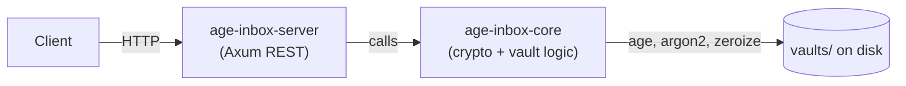

# Age Inbox Service

> Vibe coded — yes, it is vibe coded, but it should be OK.

A secure, RESTful **drop-off inbox** written in Rust. Create a password-protected vault and let
clients upload files into it over HTTP: the server encrypts every upload with the vault's public key
before it reaches disk, and content can be decrypted only after unlocking with the password. Files
are encrypted at rest and streamed, so keys and large payloads never stay in memory.

## The mental model

An inbox is asymmetric by design:

- **Write side (broad):** nothing has to be shared with uploaders beyond reachability and the vault's
  `allow_upload` flag. The client sends the file to `POST /inbox/{name}/upload` and the **server**
  encrypts it with the recipient stored in `.inbox-age.config`. The uploader supplies no key
  material, cannot read what it wrote, and cannot decrypt anything.
- **Read side (narrow):** the vault owner reconstructs the private key from the password and only
  then can list, download, or read metadata.

Because the private key is *derived* from `(password, vault name)` instead of being stored, the
server never persists a decryption key.

> **The public key is not an upload credential.** Encryption happens server-side, so the recipient
> key is never sent by a client and possessing it grants no access. `POST /inbox` returns it for
> identification and for tooling that writes `age` ciphertext straight into the vault directory —
> note that **no HTTP endpoint accepts pre-encrypted payloads**, and a `.age` file placed by hand is
> only usable if you also produce a matching `.meta.age` sidecar; otherwise the listing endpoints
> skip it and downloads fail. And since the server handles the plaintext in transit, this is **not**
> end-to-end encryption — transport security (TLS) matters.

## Architecture at a glance

This repository is a Cargo workspace with **two crates**. Everything the server does is delegated to
the core; the server adds HTTP, permissions, streaming and concurrency.

| Crate | Package | Artifact | Responsibility |
|-------|---------|----------|----------------|
| Root | `age-inbox-server` | lib `age_inbox` + bin `age-inbox-server` | Axum REST API, routing, CORS, body limits, TLS, permission enforcement |
| `crates/age-inbox-core` | `age-inbox-core` | library only | Deterministic key derivation, vault lifecycle, streaming AGE encrypt/decrypt, metadata sidecars |

Dependency direction is one-way:



- `src/lib.rs` re-exports the core modules, so handlers use `crate::inbox_core::...` and
  `crate::crypto::...` directly.
- The core has **no HTTP dependency** and can be embedded in other Rust projects. See
  [`crates/age-inbox-core/API.md`](crates/age-inbox-core/API.md).

Read next:

- **[docs/ARCHITECTURE.md](docs/ARCHITECTURE.md)** — crate layout, module map, state ownership,
  request lifecycle, on-disk layout.
- **[docs/PROTOCOL.md](docs/PROTOCOL.md)** — the end-to-end protocol and step-by-step use-case flows
  (create, upload, list, download + range, metadata, delete, lock/unlock, raw access).
- **[docs/API.md](docs/API.md)** — endpoint reference with status codes and semantics.
- **[docs/openapi.yaml](docs/openapi.yaml)** — machine-readable OpenAPI 3 contract.
- **[docs/CRYPTO_MODEL.md](docs/CRYPTO_MODEL.md)** — key derivation and threat model.
- **[docs/SPECIFICATION.md](docs/SPECIFICATION.md)** — design specification and non-goals.

## Cryptography in one paragraph

Vault content is encrypted with [age](https://github.com/C2SP/C2SP/blob/main/age.md) using X25519
recipients — the `age` Rust crate, no custom format. The vault keypair is derived deterministically
from the password and vault name: a 16-byte salt built from the name is fed to
`argon2::Argon2::default()` (**Argon2id**, 32-byte output), the bytes are encoded as an
`AGE-SECRET-KEY-...` Bech32 string and parsed as an `age` X25519 identity. Encryption and decryption
are fully streamed, so memory stays flat regardless of file size (the core's reader-based encryptor
uses a 128 KiB buffer). The derived identity is held in memory only while a vault is unlocked
(1 hour) and is zeroized on drop.

## Quickstart

### Docker Compose

```bash
docker compose up --build -d
```

The bundled [`docker-compose.yml`](docker-compose.yml) builds the image, publishes the API on port
`3000`, and persists vaults in a **named volume** (`age-inbox-data`) mounted at `/app/vaults`.

If you prefer the host directory to be visible (for backups, inspection, etc.), bind-mount it
instead of using a named volume:

```yaml
services:
  age-inbox:
    build: .
    container_name: age-inbox
    environment:
      - CORS_ALLOWED_ORIGINS=http://localhost:4200
      - CORS_ALLOWED_METHODS=GET,POST,DELETE,OPTIONS
      - CORS_ALLOWED_HEADERS=content-type,range
      - CORS_ALLOW_CREDENTIALS=false
      - CORS_MAX_AGE_SECS=600
      - MAX_UPLOAD_SIZE_BYTES=1073741824
      - RUST_LOG=info
    ports:
      - "3000:3000"
    volumes:
      - ./vaults:/app/vaults
    restart: unless-stopped
```

```bash
docker compose up -d
```

### Prebuilt image (GHCR)

```yaml
services:
  age-inbox:
    image: ghcr.io/cypherbits/age-inbox:latest
    container_name: age-inbox
    environment:
      - CORS_ALLOWED_ORIGINS=http://localhost:4200
      - RUST_LOG=info
    ports:
      - "3000:3000"
    volumes:
      - ./vaults:/app/vaults
    restart: unless-stopped
```

### Native execution

```bash
cargo run --release
```

Listens on HTTP `0.0.0.0:3000` and creates/uses a local `./vaults` directory.

Override bind address and storage path:

```bash
cargo run --release -- --host 127.0.0.1 --port 3001 --vaults-dir ./my-vaults
```

## Configuration

### Command-line flags

| Flag | Default | Description |
|------|---------|-------------|
| `--host <IP>` | `0.0.0.0` | Interface to bind. |
| `--port <PORT>` | `3000` | TCP port. |
| `--vaults-dir <PATH>` | `./vaults` | Root directory for all vaults (created if missing). |
| `--https` | off | Serve TLS with `cert.pem`/`key.pem` (self-signed and generated on first run if absent). |

> **Note:** the vault directory is configured **only** through `--vaults-dir`. The `VAULTS_DIR`
> environment variable set in the `Dockerfile` is **not read by the server**; it works there merely
> because the container's working directory is `/app`, so the default `./vaults` resolves to
> `/app/vaults`.

### Environment variables

| Variable | Default | Description |
|----------|---------|-------------|
| `CORS_ALLOWED_ORIGINS` | unset | Comma-separated origins, or `*`. If unset, **no CORS headers are added**. |
| `CORS_ALLOWED_METHODS` | unset | Comma-separated methods, or `*`. |
| `CORS_ALLOWED_HEADERS` | unset | Comma-separated request headers, or `*`. `content-type` and `range` are always added when a list is given. |
| `CORS_EXPOSE_HEADERS` | unset | Comma-separated response headers. `content-disposition`, `content-range` and `accept-ranges` are always added when a list is given. |
| `CORS_ALLOW_CREDENTIALS` | `false` | Accepts `true/false`, `1/0`, `yes/no`, `on/off`. |
| `CORS_MAX_AGE_SECS` | unset | Preflight cache duration in seconds. |
| `MAX_UPLOAD_SIZE_BYTES` | `1073741824` (1 GiB) | Maximum request body size (applied to the whole router; uploads are the payloads that matter). |
| `RUST_LOG` | `info` | `tracing` filter, e.g. `age_inbox=debug,tower_http=info`. |

CORS is only activated when `CORS_ALLOWED_ORIGINS` is set. All other `CORS_*` variables refine that
layer. No methods or headers are allowed by default, so browser clients need at least
`CORS_ALLOWED_METHODS=GET,POST,DELETE,OPTIONS` and `CORS_ALLOWED_HEADERS=content-type,range`.

Example:

```bash
CORS_ALLOWED_ORIGINS=http://localhost:4200,https://app.example.com \
CORS_ALLOWED_METHODS=GET,POST,DELETE,OPTIONS \
CORS_ALLOWED_HEADERS=content-type,range \
CORS_EXPOSE_HEADERS=content-disposition,content-range,accept-ranges \
CORS_ALLOW_CREDENTIALS=false \
CORS_MAX_AGE_SECS=600 \
MAX_UPLOAD_SIZE_BYTES=2147483648 \
RUST_LOG=info \
cargo run --release
```

### Enabling HTTPS

```bash
cargo run --release -- --https
```

On the first run with `--https`, a self-signed `cert.pem` and `key.pem` are generated in the current
directory and reused afterwards. Because the certificate is stable across restarts, clients can pin
its public key or certificate hash to defend against MITM attacks.

## Vault permission model

Each vault stores its policy in `.inbox-age.config` and the server re-reads it **on every request**,
so edits take effect immediately. Permissions gate the following endpoints:

| Permission | Default | Endpoints gated |
|------------|---------|-----------------|
| `allow_subfolders` | `false` | `POST /inbox/{name}/upload/{*path}` |
| `allow_upload` | `true` | `POST /inbox/{name}/upload`, `POST /inbox/{name}/upload/{*path}` |
| `allow_download` | `true` | `GET /inbox/{name}/download/{*path}`, `GET /inbox/{name}/raw/download/{*path}` |
| `allow_list` | `true` | `GET /inbox/{name}/list`, `GET /inbox/{name}/raw/list` |
| `allow_delete` | `true` | `DELETE /inbox/{name}/delete/{*path}`, `DELETE /inbox/{name}/raw/delete/{*path}` |
| `allow_metadata` | `true` | `GET /inbox/{name}/metadata/{*path}` |
| `allow_lock_unlock` | `true` | `POST /inbox/{name}/unlock`, `POST /inbox/{name}/lock` |

`POST /inbox` and `GET /inbox/{name}/config` are not gated by permissions.

Granular overrides are supplied at creation time and merged over the defaults:

```json
{
  "name": "my-vault",
  "password": "super-secret",
  "permissions": { "allow_subfolders": true, "allow_download": false }
}
```

Afterwards, edit `.inbox-age.config` directly to change the policy.

## On-disk layout

```
vaults/
└── <vault-name>/
    ├── .inbox-age.config        # public recipient + permissions (no secrets)
    ├── drop-3f9c....age         # encrypted payload (AGE, X25519 recipient)
    ├── drop-3f9c....meta.age    # encrypted JSON metadata sidecar
    └── <subfolder>/             # only when allow_subfolders is enabled
        ├── drop-....age
        └── drop-....meta.age
```

`.inbox-age.config` is a line-oriented text file:

```
inbox-name: my-vault
public-key: age1...
permissions: {"allow_subfolders":false,"allow_upload":true,"allow_download":true,"allow_list":true,"allow_delete":true,"allow_metadata":true,"allow_lock_unlock":true}
```

- `inbox-name` is written for humans; the server never reads it.
- `public-key` is the X25519 recipient. It is the only value required to upload.
- A missing `permissions` line falls back to defaults (permissive except `allow_subfolders`).

You can inspect the public policy without authenticating:

```bash
curl http://localhost:3000/inbox/my-vault/config
```

## Security notes

- **The vault name is part of the key.** The salt is derived from the vault name, so renaming or
  moving a vault directory makes existing ciphertext permanently undecryptable.
- **Only the first 16 bytes of the vault name feed the salt.** Two names that share their first 16
  bytes derive the same keys for a given password.
- **The public key is not an upload credential.** Uploading requires only network access and
  `allow_upload`; the server encrypts with the recipient stored in `.inbox-age.config`. With the
  default policy, any reachable client can therefore write to a vault.
- **The public key is returned only by `POST /inbox`.** There is no endpoint to fetch it later, so
  capture it at creation time (or read it from `.inbox-age.config`).
- **Uploads accept plaintext only.** No endpoint accepts a pre-encrypted `age` payload, so
  "client-side encryption" would mean writing the `.age` file and its `.meta.age` sidecar into the
  vault directory yourself.
- **Uploads are not end-to-end encrypted.** The server receives plaintext and encrypts it itself;
  without TLS, a network observer can read an upload in flight.
- **The `raw/*` endpoints are unauthenticated.** Anyone who can reach the server can list, download
  ciphertext and (with `allow_delete`) delete files while a vault is locked. Decryption still
  requires the password. Restrict network access, and set `allow_list`, `allow_download` or
  `allow_delete` to `false` for a locked-down deployment.
- **Unlock state is volatile.** The derived identity lives in memory for at most one hour and is
  discarded on expiry or `POST /inbox/{name}/lock`; it is never written to disk.

See [docs/CRYPTO_MODEL.md](docs/CRYPTO_MODEL.md) and [docs/PROTOCOL.md](docs/PROTOCOL.md) for the
full model.

## Tests and benchmarks

End-to-end tests boot the real server binary and exercise the endpoint flow over HTTP:

```bash
cargo test --test e2e_tests -- --test-threads=1
```

Run the whole workspace suite with:

```bash
cargo test --workspace
```

The core crate ships `criterion` benchmarks for the low-level encrypt/decrypt, range-decrypt,
metadata and vault-lifecycle paths:

```bash
cargo bench -p age-inbox-core
```

HTML reports land in `target/criterion/report/index.html`. For CPU/memory profiling, try
`samply record cargo bench -p age-inbox-core`.

## Documentation map

| Document | What it covers |
|----------|----------------|
| [docs/ARCHITECTURE.md](docs/ARCHITECTURE.md) | Workspace layout, crate boundaries, module map, state and concurrency, at-rest layout |
| [docs/PROTOCOL.md](docs/PROTOCOL.md) | Wire protocol, naming/addressing, session model, use-case flows, error matrix |
| [docs/API.md](docs/API.md) | Endpoint-by-endpoint reference (requests, responses, status codes) |
| [docs/openapi.yaml](docs/openapi.yaml) | OpenAPI 3 contract |
| [docs/CRYPTO_MODEL.md](docs/CRYPTO_MODEL.md) | Key derivation, secret handling, threat model |
| [docs/SPECIFICATION.md](docs/SPECIFICATION.md) | Design goals, layering and non-goals |
| [crates/age-inbox-core/API.md](crates/age-inbox-core/API.md) | Public Rust API of the core library |

## License

MIT (see the core crate's `Cargo.toml`).
