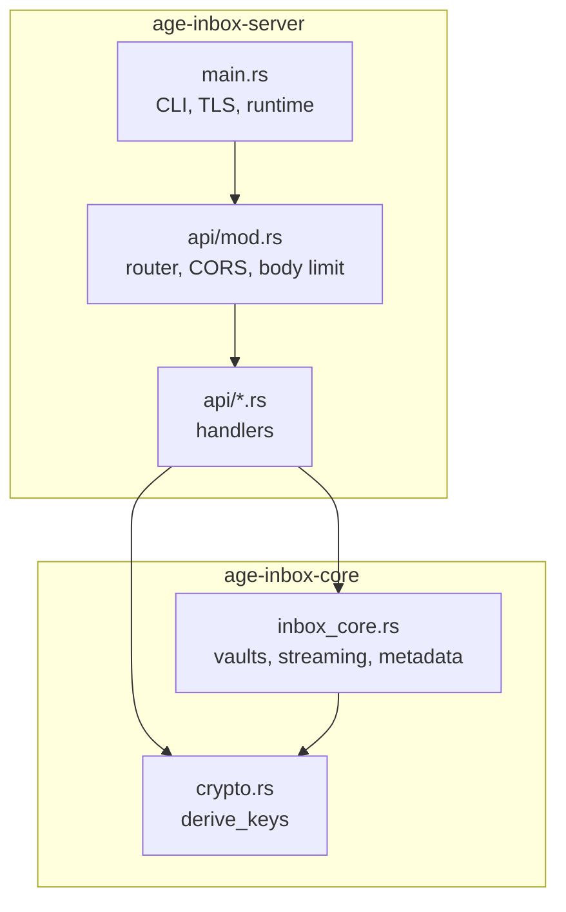
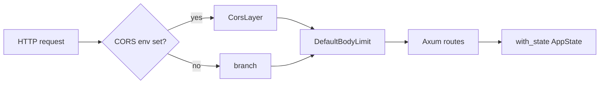
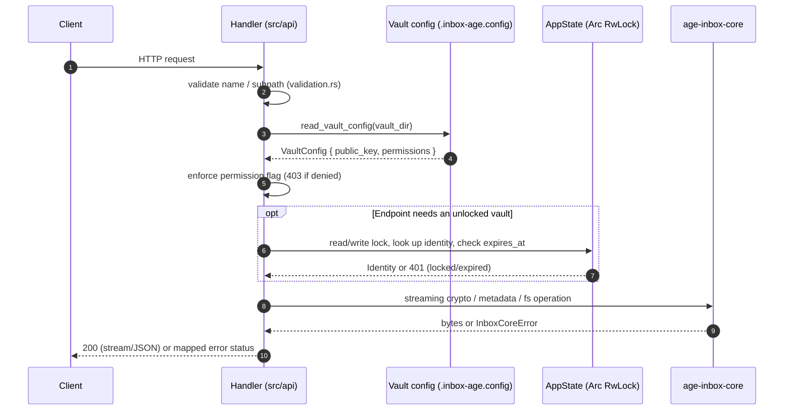

# Architecture

This document explains how the Age Inbox Service is put together: the two-crate workspace, the
responsibilities on each side of the boundary, how state is owned, and what a request actually does.

- Audience: contributors and integrators.
- Related: [`PROTOCOL.md`](PROTOCOL.md) (wire protocol and flows), [`API.md`](API.md) (endpoint
  reference), [`CRYPTO_MODEL.md`](CRYPTO_MODEL.md) (cryptography),
  [`../crates/age-inbox-core/API.md`](../crates/age-inbox-core/API.md) (core library API).

## 1. Scope

The system stores encrypted files for named vaults and exposes them over HTTP. It does **not**
implement its own cryptography: files are `age` ciphertext, and the vault key is derived with
Argon2id. The architecture is deliberately split so that the cryptographic and storage behaviour is
usable without HTTP, and the HTTP layer is a thin, well-defined wrapper.

## 2. Workspace layout

```
.
├── Cargo.toml                     # workspace root: [package] age-inbox-server + [workspace] members
├── src/                           # REST server crate (package age-inbox-server)
│   ├── main.rs                    # binary: CLI parsing, runtime, TLS/plain HTTP, AppState
│   ├── lib.rs                     # re-exports core modules as crate::crypto / crate::inbox_core
│   └── api/                       # one module per endpoint + shared helpers
├── crates/
│   └── age-inbox-core/            # library crate (package age-inbox-core)
│       ├── src/crypto.rs          # deterministic key derivation
│       ├── src/inbox_core.rs      # vault lifecycle, streaming I/O, metadata, errors
│       ├── benches/               # criterion benchmarks
│       └── API.md                 # public API reference
├── tests/                         # integration tests against the router / real binary
│   └── e2e/                       # binary-booting end-to-end helpers and flows
└── docs/                          # this documentation set
```

| Crate | Kind | Depends on | Must not depend on |
|-------|------|-----------|--------------------|
| `age-inbox-server` (`age_inbox`) | library + binary | `age-inbox-core`, Axum, Tokio, tower-http, axum-server, clap | — |
| `age-inbox-core` | library | `age`, `argon2`, `zeroize`, `tokio` (fs/io-util), `tokio-util` | `axum`, `tower-http`, `clap`, HTTP types |

The dependency edge is strictly one-way:



`src/lib.rs` is the seam:

```rust
pub mod api;
pub use age_inbox_core::crypto;
pub use age_inbox_core::inbox_core;
```

Handlers therefore call `crate::inbox_core::...` with no additional abstraction layer; the core is
the implementation, not a plugin.

## 3. The core crate (`age-inbox-core`)

The core owns every decision that touches key material, ciphertext or the vault directory. It has no
knowledge of HTTP, routing or permissions *policy* — it exposes permission **flags** as data and
lets the caller enforce them.

### 3.1 `crypto` — deterministic key derivation

```rust
pub struct Keys { pub identity: age::x25519::Identity, pub recipient: age::x25519::Recipient }
pub fn derive_keys(password: &str, vault_name: &str) -> anyhow::Result<Keys>
```

Steps:

1. Build a 16-byte salt from `vault_name`:
   - the first up-to-16 bytes of the name are copied in;
   - remaining bytes are filled with `i ^ 0xAA` (domain separation so short names still yield a
     stable, well-defined 16-byte salt).
2. `argon2::Argon2::default().hash_password_into(password, salt, &mut key_bytes)` → 32 bytes
   (Argon2id).
3. Bech32-encode with HRP `AGE-SECRET-KEY-` and uppercase it.
4. Parse as `age::x25519::Identity`, then derive the `Recipient` via `identity.to_public()`.
5. Zeroize the raw derived bytes; secret strings are wrapped in `Zeroizing`.

Consequences worth remembering:

- Derivation is deterministic — `(password, vault_name)` always yields the same keypair.
- The vault **name is not just a label**: it is key-derivation context. Renaming a vault directory
  breaks decryption of everything inside it.
- Only the first 16 bytes of the name influence the salt, so two names sharing a 16-byte prefix
  derive identical keys for the same password.

### 3.2 `inbox_core` — vaults, streaming and metadata

| Group | Items |
|-------|-------|
| Types | `VaultPermissions`, `VaultConfig`, `CreateVaultResult`, `UnlockedVault`, `FileMetadata`, `InboxCoreError` |
| Validation | `is_valid_name`, `is_valid_subpath` |
| Path helpers | `metadata_sidecar_for`, `generate_drop_filename` |
| Config I/O | `read_vault_config_file`, `write_vault_config_file` |
| Lifecycle | `create_vault`, `unlock_vault`, `lock_vault`, `get_unlocked_identity` |
| Streaming crypto | `encrypt_reader_to_age_file`, `decrypt_age_file_to_writer`, `decrypt_age_file_range_to_writer` |
| Metadata crypto | `encrypt_metadata_file`, `decrypt_metadata_file` |

Design notes:

- **Unlock state is caller-owned.** `unlock_vault`, `lock_vault` and `get_unlocked_identity` take a
  `&mut HashMap<String, UnlockedVault>`. The core never creates locks or global state, so embedding
  applications can decide their own concurrency strategy.
- **Expiry is lazy.** `UnlockedVault` carries `expires_at: std::time::Instant`; nothing evicts it in
  the background. `get_unlocked_identity` removes an expired entry and returns
  `VaultUnlockExpired` when it is next consulted.
- **Streaming is fixed-memory.** `encrypt_reader_to_age_file` reads into a 128 KiB buffer and feeds
  an `age::Encryptor`; `decrypt_age_file_range_to_writer` drains `start` bytes into `io::sink()` and
  then copies `end - start + 1` bytes, so memory is `O(chunk)` rather than `O(file)`.
- **Passphrase mode is rejected.** `decrypt_age_file_to_writer` and the range variant return
  `Crypto("passphrase encryption not supported")` when the `age` header is scrypt, because vaults
  only ever produce X25519 recipients.
- **Lenient config parsing.** `read_vault_config_file` scans line prefixes (`public-key: `,
  `permissions: `). A missing/unparseable `permissions` line falls back to
  `VaultPermissions::default()`. Only an empty `public-key` produces `InvalidConfig`. Do not treat
  this parser as an airtight security boundary — the server maps it to its own errors.

### 3.3 Error model

`InboxCoreError` is a flat enum implemented with `Display` + `std::error::Error`:

| Variant | Raised by | Meaning |
|---------|-----------|---------|
| `InvalidName` | create/unlock/lock | Name is empty or contains `/`, `\` or `..` |
| `InvalidSubpath` | validation | Reserved (path checks live in the server's `validation`) |
| `VaultExists` | `create_vault` | Vault directory already present |
| `VaultNotFound` | unlock/lock | Vault directory absent |
| `VaultConfigMissing` | config I/O | `.inbox-age.config` unreadable |
| `InvalidConfig` | config I/O | `public-key` missing |
| `InvalidPassword` | `unlock_vault` | Derived recipient ≠ stored public key |
| `VaultLocked` | `get_unlocked_identity` | No session entry |
| `VaultUnlockExpired` | `get_unlocked_identity` | Session entry past `expires_at` |
| `Io(String)` | file operations | Filesystem failure |
| `Crypto(String)` | `age` / Argon2 | Crypto failure, or lock/unlock disabled |
| `Serialize(String)` | metadata | JSON (de)serialization failure |

Each handler owns a `map_core_error` function that translates these variants into HTTP responses;
there is no central mapping table, so status codes are per-endpoint (see
[`API.md`](API.md#error-model)).

## 4. The server crate (`age-inbox-server`)

### 4.1 Binary and CLI

`src/main.rs` parses flags with `clap`, initializes `tracing_subscriber`, creates the vaults
directory, builds `AppState`, then serves either plain HTTP (`axum::serve`) or TLS
(`axum_server::bind_rustls`). With `--https`, a self-signed certificate for `localhost`/`127.0.0.1`
is generated via `rcgen` on first run and reused afterwards.

### 4.2 Module map (`src/api/`)

| Module | Responsibility |
|--------|----------------|
| `mod.rs` | `router(state)`, CORS layer from env, `DefaultBodyLimit`, route table |
| `types.rs` | `AppState`, request/response DTOs, `ApiError`, `make_error`, `permission_denied` |
| `config.rs` | `read_vault_config` wrapper + core→HTTP error mapping for config reads |
| `validation.rs` | `is_valid_name`, `is_valid_subpath` (server-side copies) |
| `http_range.rs` | `parse_single_range`, `unsatisfied_content_range` |
| `create_inbox.rs` | `POST /inbox` |
| `vault_config.rs` | `GET /inbox/{name}/config` |
| `upload.rs` | `POST /inbox/{name}/upload[/{path}]` — multipart streaming, atomic rename |
| `unlock.rs` | `POST /inbox/{name}/unlock` |
| `lock.rs` | `POST /inbox/{name}/lock` |
| `list_files.rs` | `GET /inbox/{name}/list`, plus the shared `walk_dir` helper |
| `list_files_raw.rs` | `GET /inbox/{name}/raw/list` |
| `download.rs` | `GET /inbox/{name}/download/{path}` — decrypted, Range-aware |
| `download_raw.rs` | `GET /inbox/{name}/raw/download/{path}` — ciphertext, seekable Range |
| `metadata.rs` | `GET /inbox/{name}/metadata/{path}` |
| `delete.rs` | `DELETE /inbox/{name}/delete/{path}` — requires unlocked |
| `delete_raw.rs` | `DELETE /inbox/{name}/raw/delete/{path}` — works locked |

### 4.3 `AppState`

```rust
#[derive(Clone)]
pub struct AppState {
    pub unlocked_vaults: Arc<RwLock<HashMap<String, UnlockedVault>>>,
    pub vaults_dir: PathBuf,
}
```

`Arc<RwLock<...>>` (Tokio's async `RwLock`) is the single piece of shared mutable state. It is
cloned into every handler by `axum`'s `State` extractor. Each handler decides whether it needs a
read or a write guard, and holds it for the minimum scope.

### 4.4 Router

`router(state)` assembles the route table shown in [`API.md`](API.md#endpoint-summary), applies
`DefaultBodyLimit::max(MAX_UPLOAD_SIZE_BYTES)`, attaches the state, and optionally layers CORS.



Order matters: the CORS layer is applied **outside** the body limit so preflight responses are still
produced when a body would be rejected.

### 4.5 Request lifecycle



Every request re-reads the config file, which is why permission edits are picked up immediately and
why the file is a hot path (one small read per request).

### 4.6 Notable behaviours

- **Uploads are atomic-ish.** `upload.rs` streams ciphertext into `drop-<hex>.age.tmp`, writes the
  sidecar to `drop-<hex>.meta.age.tmp`, then renames sidecar first and payload second. A
  `CleanupGuard` deletes the `.tmp` files if the handler exits before both renames succeed, so a
  failed request does not leave partial files behind.
- **`raw/list` requires a sidecar.** Unlike the unlocked list (which skips undecryptable sidecars),
  `list_files_raw.rs` skips any `.age` file whose `.meta.age` companion is missing.
- **Range handling differs by endpoint.** `download_raw.rs` seeks the file on disk and streams the
  slice. `download.rs` cannot seek ciphertext, so it decrypts from the beginning; when the sidecar
  records a plaintext size it uses `decrypt_age_file_range_to_writer` to skip to the range, and
  otherwise it decrypts the **whole** file into memory as a fallback.
- **KDF runs on a blocking thread.** `create_inbox.rs` and `unlock.rs` wrap their core calls in
  `tokio::task::spawn_blocking` so Argon2 does not stall an async worker.
- **Delete variants differ only in lock requirements.** Both remove the payload and, if present, the
  sidecar. `delete.rs` requires an entry in `unlocked_vaults` (it checks presence, not expiry);
  `delete_raw.rs` does not require unlock at all.
- **Duplicate validation.** `is_valid_name` / `is_valid_subpath` exist in both the core and
  `src/api/validation.rs`. The server's copies are authoritative for request handling; the core
  keeps its own so it stays safe when embedded.

## 5. Data at rest

```
<vaults_dir>/
└── <vault-name>/
    ├── .inbox-age.config          # inbox-name, public-key, permissions JSON
    ├── drop-<32 hex>.age          # AGE ciphertext for one uploaded file
    ├── drop-<32 hex>.meta.age     # AGE ciphertext of the FileMetadata JSON
    └── <subpath>/
        ├── drop-<32 hex>.age
        └── drop-<32 hex>.meta.age
```

- No private key material is ever written to disk.
- `metadata_sidecar_for("x.age")` → `"x.meta.age"`. Files already ending in `.meta.age` have no
  sidecar.
- Directory walking (`walk_dir` in `list_files.rs`) ignores any entry whose name starts with `.`,
  which excludes `.inbox-age.config` and hides dotfiles.
- `write_vault_config_file` writes `inbox-name`, but `read_vault_config_file` never reads it — the
  field is informational only.

### Metadata semantics

`FileMetadata` is `{ filename, origin, filesize, ...extended }` where `extended` is flattened into
the JSON object. Be aware of two different meanings of `filesize`:

| Source | `filesize` meaning |
|--------|--------------------|
| Sidecar written by upload | **Plaintext** byte count of the uploaded file |
| `GET /inbox/{name}/metadata/{path}` | **Ciphertext** size on disk (the handler overwrites the sidecar value) |
| `size` in `GET .../list` and `.../raw/list` | **Ciphertext** size on disk |

Range responses are computed from the sidecar value (plaintext) because byte ranges apply to
decrypted content. This split is a known inconsistency; see [`PROTOCOL.md`](PROTOCOL.md#9-size-and-range-semantics).

## 6. Concurrency, streaming and memory

- **Shared state:** only `unlocked_vaults`. Handlers take a short `read`/`write` guard; no lock is
  held across an `await` that performs disk I/O.
- **Reads vs writes:** `download.rs` and `metadata.rs` take a write guard because they evict expired
  entries; `list_files.rs` and `delete.rs` take a read guard.
- **Request limits:** `DefaultBodyLimit::max(MAX_UPLOAD_SIZE_BYTES)` caps upload bodies. On top of
  that, non-file multipart fields are capped at 64 KiB (`413` on overflow).
- **Memory profile:** uploads and full downloads are streamed end to end. Uploads pipe multipart
  chunks straight into the `age` encryptor as they arrive; full downloads wrap the decryptor in a
  `ReaderStream`. The core's reader-based `encrypt_reader_to_age_file` uses a 128 KiB buffer, and
  `decrypt_age_file_range_to_writer` streams decrypted chunks after skipping the offset. The
  exceptions are metadata (small, fully buffered) and the `download.rs` no-sidecar range fallback,
  which buffers the whole decrypted payload.

## 7. Extension points

- **New endpoints:** add `src/api/<name>.rs`, register in `mod.rs`, and reuse `config::read_vault_config`,
  `types::make_error` and the permission helpers.
- **New permissions:** add a field to `VaultPermissions` in the core (with a default), implement the
  check in the relevant handler, and expose it in `CreateInboxPermissionsReq` and
  `CreateInboxPermissions` in `docs/openapi.yaml`.
- **New crypto parameters:** `crypto::derive_keys` is the single place where Argon2 parameters and
  salt construction live. Changing them is a breaking change for existing vaults.
- **Embedding the core:** depend on `age-inbox-core` and own your own session map and runtime; see
  the core's `API.md`.

## 8. Known gaps

Tracked here so the documentation stays honest rather than aspirational:

- No endpoint returns a vault's `public-key` after creation; capture it from `POST /inbox` if you
  need it. Uploads do not require it — the server encrypts with the recipient from
  `.inbox-age.config` — and there is no endpoint that accepts a pre-encrypted payload, so
  client-side encryption is only possible by writing the `.age` file and its `.meta.age` sidecar
  into the vault directory directly.
- `filesize` is inconsistent between sidecar, `/metadata` and `/list` (see above).
- `is_valid_subpath` accepts empty path segments and does not normalise `.`; it only rejects `..`,
  leading `/` and `\`.
- `delete.rs` checks `unlocked_vaults.contains_key` without consulting `expires_at`, so a stale
  session entry still authorises deletion.
- The `raw/*` endpoints are unauthenticated by design; setting `allow_delete: true` lets any client
  that can reach the server delete vault files.

## 9. Related documents

- [`PROTOCOL.md`](PROTOCOL.md) — protocol and use-case flows.
- [`API.md`](API.md) — endpoint reference.
- [`CRYPTO_MODEL.md`](CRYPTO_MODEL.md) — cryptography and threat model.
- [`SPECIFICATION.md`](SPECIFICATION.md) — design goals and non-goals.
- [`../crates/age-inbox-core/API.md`](../crates/age-inbox-core/API.md) — core library API.
