# Protocol

This document specifies how a client talks to the Age Inbox Service and what happens end to end.
It covers the HTTP contract, the naming/addressing rules, the unlock-session model, and the concrete
use-case flows.

The service does not define a custom wire protocol: it is plain HTTP/1.1 or HTTP/2 over TLS with
JSON control messages and streamed binary bodies. What is project-specific — and specified here — is
the **naming and session semantics layered on top of REST**.

- Audience: client authors and operators.
- Related: [`ARCHITECTURE.md`](ARCHITECTURE.md), [`API.md`](API.md), [`CRYPTO_MODEL.md`](CRYPTO_MODEL.md).

## 1. Conventions

| Aspect | Value |
|--------|-------|
| Base URL | `http(s)://<host>:<port>` (default `http://0.0.0.0:3000`) |
| Control messages | `application/json` |
| Uploads | `multipart/form-data` |
| File bodies | `application/octet-stream` |
| Error bodies | `application/json` → `{ "error": "<message>" }` for handler errors (see [§7](#7-error-model)); extractor rejections and `416` are plain text |
| Authentication | None at the transport layer; read and delete access is gated by an in-memory unlock session |
| Idempotency | None; committing operations (upload, delete) are not idempotent |

The examples below use `http://localhost:3000` and `jq` for readability.

## 2. Actors and trust model

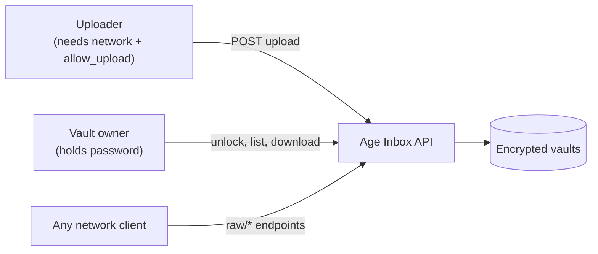

| Actor | Needs | Can do |
|-------|-------|--------|
| **Uploader** | Network access to the API with `allow_upload` enabled | Upload files. The server encrypts them with the vault recipient, so the uploader handles no key material and cannot read what it wrote |
| **Owner** | The password | Everything, after unlocking |
| **Any network client** | Network access only | List, download ciphertext and (if allowed) delete via `raw/*` endpoints; cannot decrypt |

The password is never sent anywhere except to `POST /inbox/{name}/unlock`, where it is used to
re-derive the identity and then discarded.

**Note on the public key.** Encryption in this service is **server-side**: the client POSTs
plaintext and the server uses the recipient from `.inbox-age.config`. The public key is therefore
not an upload credential and is not required by any REST request. `POST /inbox` returns it for
identification and for writers that encrypt out of band — but there is **no endpoint that accepts
pre-encrypted payloads**, so an out-of-band writer must place both the `.age` file and its
`.meta.age` sidecar into the vault storage directly. Because the server sees the plaintext, use TLS
if you do not trust the network or the host.

## 3. Resources and naming

### 3.1 Vault name

A vault name is a single path segment. The server and the core both reject names that are empty or
contain `/`, `\` or `..`. The name determines the vault directory **and** is part of key derivation
(see [`CRYPTO_MODEL.md`](CRYPTO_MODEL.md#key-derivation-strategy)).

### 3.2 Vault directory

```
<vaults_dir>/<vault-name>/
```

Created by `POST /inbox`. If it already exists, creation fails with `409`.

### 3.3 Encrypted payload naming (the `drop-` protocol)

When a file is uploaded, **the server ignores the client's filename for storage**. It generates a
random name:

```
drop-<32 lowercase hex chars>.age        e.g. drop-9f2c7a10b4e5d6c8f0a1b2c3d4e5f607.age
```

The original filename and origin are stored **inside the encrypted metadata sidecar**, never in the
path. This has two consequences:

1. To download a file you need its storage `path`, which you get from `GET .../list` or
   `GET .../raw/list` (for a locked vault) — or from the `message` returned by the upload.
2. The filename a client sees is whatever was recorded in metadata, resolved at read time by
   `GET .../list`, `GET .../metadata/...` and the `Content-Disposition` header of a download.

### 3.4 Metadata sidecar

Every uploaded payload gets a companion sidecar at the same path with the extension swapped:

```
drop-<hex>.age   ->   drop-<hex>.meta.age
```

The mapping is well defined only for files ending in `.age` and not `.meta.age`. Requests that
point at a sidecar where a payload is expected are rejected with `400`.

The sidecar is `age`-encrypted JSON:

```json
{
  "filename": "report.pdf",
  "origin": "web-form",
  "filesize": 34912,
  "tag": "monthly",
  "uploader": "alice"
}
```

`filename`, `origin` and `filesize` are first-class fields; every other multipart field is flattened
into the object as a string (`extended` in the DTO).

## 4. Access model

Two independent gates apply to most operations:

1. **Permission flags** from `.inbox-age.config` (public policy, no authentication).
2. **Unlock session** — presence of a non-expired identity in server memory.

| Endpoint | Permission | Unlock required |
|----------|-----------|-----------------|
| `POST /inbox` | — | No |
| `GET /inbox/{name}/config` | — | No |
| `POST /inbox/{name}/upload` | `allow_upload` | No |
| `POST /inbox/{name}/upload/{path}` | `allow_upload` + `allow_subfolders` | No |
| `POST /inbox/{name}/unlock` | `allow_lock_unlock` | No (this creates the session) |
| `POST /inbox/{name}/lock` | `allow_lock_unlock` | No (this ends the session) |
| `GET /inbox/{name}/list` | `allow_list` | **Yes** |
| `GET /inbox/{name}/metadata/{path}` | `allow_metadata` | **Yes** |
| `GET /inbox/{name}/download/{path}` | `allow_download` | **Yes** |
| `DELETE /inbox/{name}/delete/{path}` | `allow_delete` | **Yes** (session entry present) |
| `GET /inbox/{name}/raw/list` | `allow_list` | No |
| `GET /inbox/{name}/raw/download/{path}` | `allow_download` | No |
| `DELETE /inbox/{name}/raw/delete/{path}` | `allow_delete` | No |

All defaults are permissive (`true`) except `allow_subfolders` (`false`). A freshly created vault is
therefore an **open inbox**: anyone who can reach the API can upload, enumerate, download ciphertext
and delete. Only decryption needs the password.

## 5. Session protocol

The unlock session is server-side, per vault, and shared by all clients hitting that process.

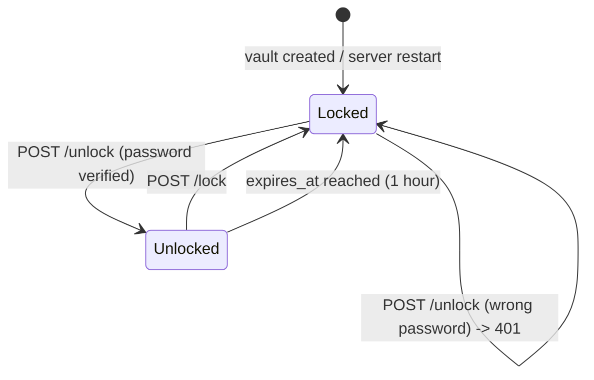

Properties:

- **Lifetime:** 3600 seconds, fixed by the API (the core takes it as a parameter).
- **Storage:** in memory only, inside `AppState.unlocked_vaults`. A server restart locks everything.
- **Lazy expiry:** nothing sweeps expired entries. `download` and `metadata` evict an expired entry
  when they touch it; `list` reports expiry without evicting; `delete` only checks presence, so a
  stale entry still authorises deletion.
- **Shared:** unlocking from one client unlocks the vault for every client of that process. There is
  no per-client token.
- **Unlock is idempotent:** calling it again with the correct password just extends `expires_at`.

## 6. Use-case flows

### 6.1 Provision a vault

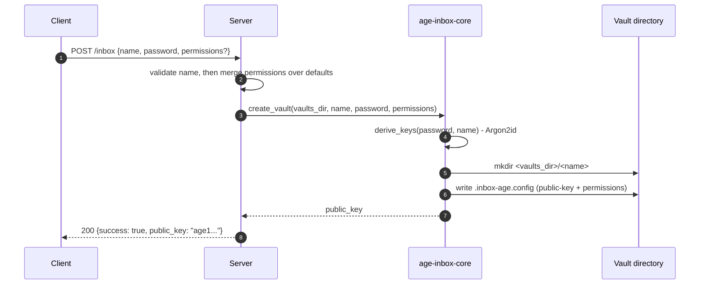

```bash
curl -sS -X POST http://localhost:3000/inbox \
  -H 'content-type: application/json' \
  -d '{"name":"my-vault","password":"super-secret","permissions":{"allow_subfolders":true}}'
```

```json
{ "success": true, "public_key": "age1qyqszqgpqyqszqgpqyqszqgpqyqszqgpqyqszqgpqyqszqgpqyqszq9g4qvz" }
```

**Persist the public key now** — no endpoint returns it later. Errors: `400` invalid name,
`409` vault exists, `415`/`400`/`422` malformed request.

### 6.2 Upload at the vault root

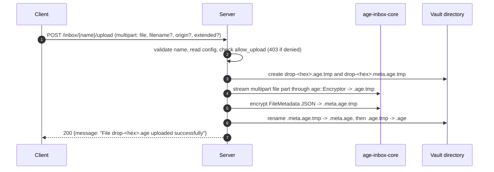

```bash
curl -sS -X POST http://localhost:3000/inbox/my-vault/upload \
  -F 'file=@report.pdf' \
  -F 'origin=web-form' \
  -F 'extended={"tag":"monthly"}'
```

Notes:

- The `file` part is required; without it the request fails `400`.
- `filename` is optional. Priority: a non-empty `filename` field, otherwise the multipart file
  part's filename. If neither exists, `400`.
- Any unrecognised multipart field is stored in the sidecar's `extended` object as a string.
- Non-file fields are capped at **64 KiB** each (`413` beyond that).
- Total body size is capped by `MAX_UPLOAD_SIZE_BYTES` (1 GiB default); exceeding it rejects the
  request.
- A non-multipart `Content-Type` is rejected with `415`.

### 6.3 Upload into a subfolder

Same as [§6.2](#62-upload-at-the-vault-root) with a path segment:

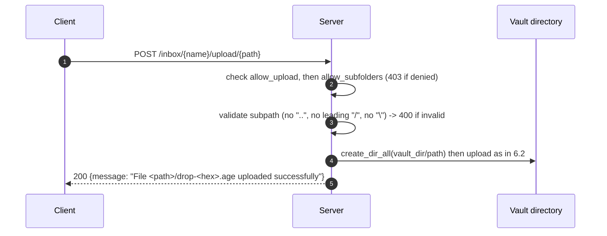

```bash
curl -sS -X POST http://localhost:3000/inbox/my-vault/upload/2026/september \
  -F 'file=@report.pdf'
```

Subfolders are created on demand. A vault with the default `allow_subfolders: false` returns `403`.

### 6.4 Unlock

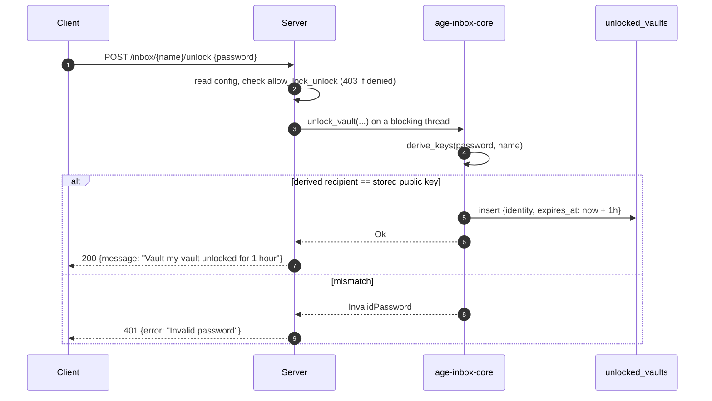

```bash
curl -sS -X POST http://localhost:3000/inbox/my-vault/unlock \
  -H 'content-type: application/json' \
  -d '{"password":"super-secret"}'
```

### 6.5 Enumerate files

Two variants, depending on whether you can decrypt metadata:

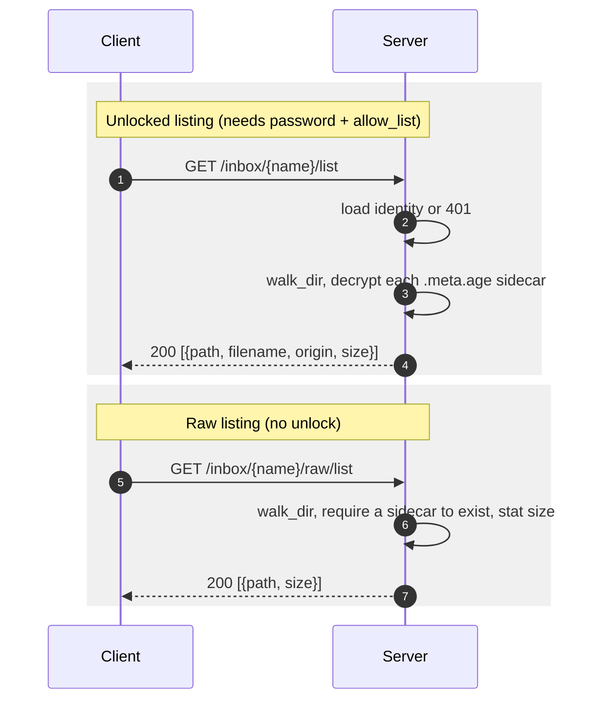

```bash
curl -sS http://localhost:3000/inbox/my-vault/list
```

```json
[
  { "path": "drop-9f2c...f607.age", "filename": "report.pdf", "origin": "web-form", "size": 35120 }
]
```

```bash
curl -sS http://localhost:3000/inbox/my-vault/raw/list
```

```json
[ { "path": "drop-9f2c...f607.age", "size": 35120 } ]
```

Both walk the vault recursively and both exclude `.meta.age` files. They differ in failure
behaviour:

- `list` requires an unlocked vault (`401` otherwise) and **skips** any payload whose sidecar is
  missing or cannot be decrypted.
- `raw/list` works while locked and **skips** any payload that has no sidecar on disk.

`size` is always the ciphertext size on disk in both endpoints.

### 6.6 Read metadata

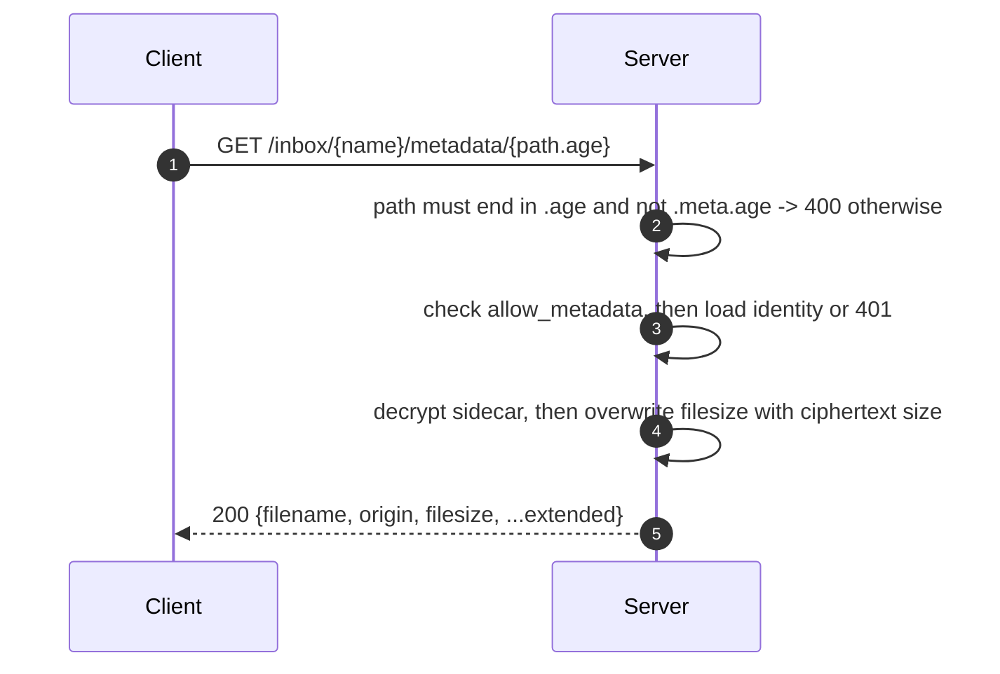

```bash
curl -sS http://localhost:3000/inbox/my-vault/metadata/drop-9f2c...f607.age
```

```json
{ "filename": "report.pdf", "origin": "web-form", "filesize": 35120, "tag": "monthly" }
```

Missing sidecar → `404`. See [§9](#9-size-and-range-semantics) about `filesize`.

### 6.7 Download a whole file

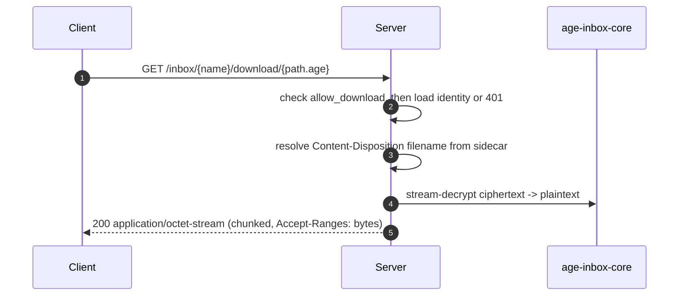

```bash
curl -sS -OJ http://localhost:3000/inbox/my-vault/download/drop-9f2c...f607.age
```

The `Content-Disposition` filename comes from the metadata sidecar, falling back to the storage name
with `.age` stripped.

### 6.8 Download a byte range

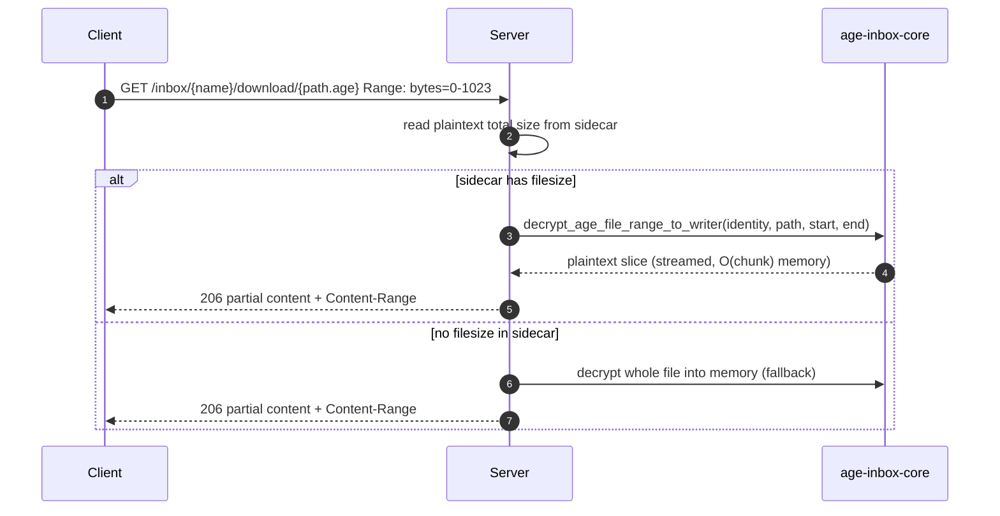

```bash
curl -sS -H 'Range: bytes=0-1023' \
  -D - -o part.bin \
  http://localhost:3000/inbox/my-vault/download/drop-9f2c...f607.age
```

```
HTTP/1.1 206 Partial Content
content-type: application/octet-stream
content-length: 1024
accept-ranges: bytes
content-range: bytes 0-1023/34912
content-disposition: attachment; filename="report.pdf"
```

Supported range forms: `bytes=a-b`, `bytes=a-` (to end) and `bytes=-n` (last `n` bytes, `n <= size`).
Multi-range requests and unsatisfiable ranges return `416` with `Content-Range: bytes */<size>` and a
**plain-text** body.

Only `GET /inbox/{name}/raw/download/{path}` supports *cheap* seeking — it reads ciphertext directly.
Decrypted ranges always require decrypting from the start of the stream, so the transfer is cheap but
the server-side CPU is not.

### 6.9 Delete

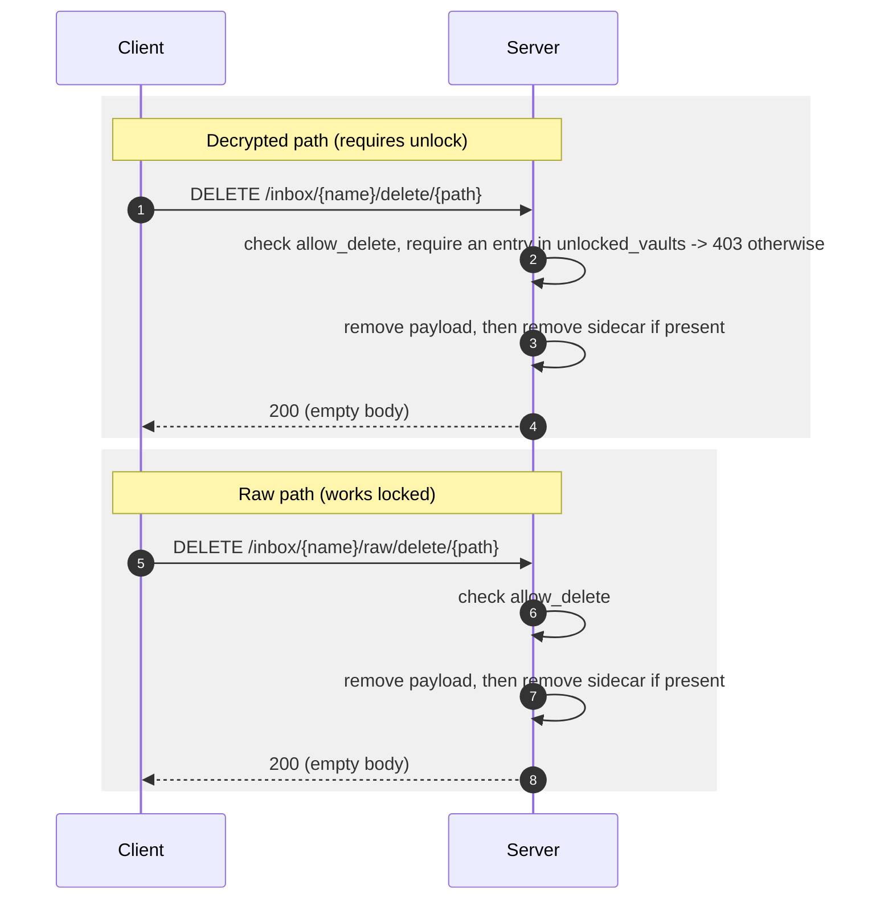

```bash
curl -sS -X DELETE http://localhost:3000/inbox/my-vault/raw/delete/drop-9f2c...f607.age -o /dev/null -w '%{http_code}\n'
```

Both variants delete the payload and its sidecar. Deletion is **not** reversible and there is no undo
or soft-delete. No `.age` suffix validation is performed here, but the resolved path must stay
inside the vault directory.

### 6.10 Lock

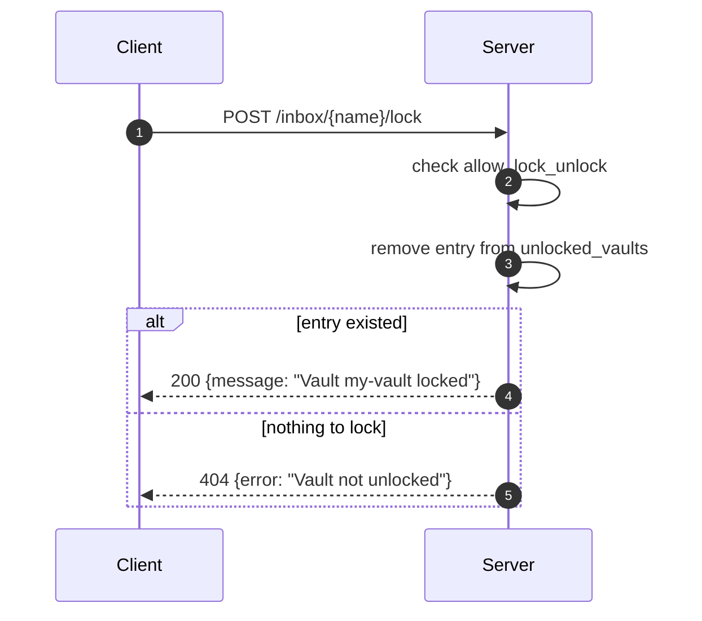

### 6.11 Raw access while locked

A client without the password can still work with ciphertext:

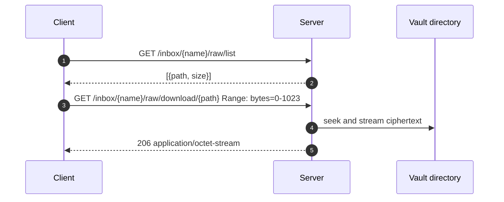

This is the intended way to back up or mirror a vault without the password. Treat it as
unauthenticated access to ciphertext (and, if `allow_delete` is on, to deletion).

## 7. Error model

Successful control operations return `200` with a JSON body (except deletes, which return `200` with
an empty body). Failures return an HTTP status plus, for handler-generated errors:

```json
{ "error": "Vault already exists" }
```

Statuses used across the API:

| Status | Meaning |
|--------|---------|
| `200` | Success |
| `206` | Partial content (range request honoured) |
| `400` | Invalid name/subpath, malformed multipart, missing `file`, missing filename, path not `.age`, field over 64 KiB |
| `401` | Invalid password, or vault is locked / unlock expired |
| `403` | Denied by vault permission, or subfolders disabled, or vault locked for delete |
| `404` | Vault, config, file or sidecar not found; lock requested on an unlocked-free vault |
| `409` | Vault already exists |
| `413` | A non-file multipart field exceeded 64 KiB |
| `415` | Wrong `Content-Type` (e.g. upload not `multipart/form-data`) |
| `416` | Range not satisfiable (plain-text body plus `Content-Range: bytes */<size>`) |
| `422` | JSON body structurally invalid (e.g. unknown field on `POST /inbox`) |
| `500` | I/O, crypto or serialization failure inside the server |

Not every error goes through the `{ "error": ... }` shape: extractor rejections produced by Axum
before a handler runs (JSON syntax/type errors, unmatched routes, method mismatches) use Axum's
default plain-text responses. Treat the status code as authoritative and the body as best-effort.

## 8. Permission enforcement details

- Config is re-read from disk on **every** request, so a policy change applies to the next request
  without a restart. There is no caching layer.
- The config parser is lenient: a missing or unparseable `permissions` line falls back to defaults
  (permissive except `allow_subfolders`).
- `POST /inbox` and `GET /inbox/{name}/config` ignore permissions; `config` returns only the
  permission object, never the public key.
- Upload checks `allow_upload` first, then `allow_subfolders` for path uploads.

## 9. Size and range semantics

`filesize`/`size` do not mean the same thing everywhere. This is the single most confusing part of
the current API:

| Where | Field | Meaning |
|-------|-------|---------|
| Sidecar JSON (as written on upload) | `filesize` | **Plaintext** bytes uploaded |
| `GET .../metadata/{path}` | `filesize` | **Ciphertext** bytes on disk (handler overwrites the sidecar value) |
| `GET .../list` | `size` | **Ciphertext** bytes on disk |
| `GET .../raw/list` | `size` | **Ciphertext** bytes on disk |
| `GET .../download/{path}` range | `Content-Range` total | **Plaintext** bytes (from the sidecar) |

Practical guidance: if you need the download size of the decrypted content, do not trust
`/metadata`; read the sidecar through the range response (`Content-Range: bytes .../N`) or track the
plaintext size at upload time. Ciphertext size is always strictly larger than plaintext because of
`age` framing and headers.

## 10. Failure and concurrency semantics

- **Upload is commit-on-rename.** Payload and sidecar are streamed to `*.tmp` files and renamed into
  place only after both are complete; a `CleanupGuard` removes the temporaries if the request aborts.
  A client disconnect mid-upload leaves no `drop-*.age` file behind (only the ephemeral `.tmp`, which
  is cleaned up on the error path).
- **Sidecar-before-payload ordering.** The metadata sidecar is renamed first. A crash between the two
  renames leaves an orphan `.meta.age` with no payload; both `list` and `raw/list` only consider
  `.age` payloads, so it is never returned.
- **No cross-request transactions.** Concurrent uploads are independent and use random names, so they
  do not collide.
- **Delete vs. download races are not coordinated.** A download that has already opened the file
  continues; a delete in parallel removes the path. There is no locking per file.
- **One unlock session per vault per process.** Unlocking affects every client. Running multiple
  server instances against the same vault directory does not share sessions, and concurrent writers
  are not coordinated beyond filesystem semantics.

## 11. End-to-end client recipe

A complete write-then-read round trip:

```bash
BASE=http://localhost:3000
VAULT=my-vault
PASS=super-secret

# 1. Provision
KEY=$(curl -sS -X POST "$BASE/inbox" \
  -H 'content-type: application/json' \
  -d "{\"name\":\"$VAULT\",\"password\":\"$PASS\"}" | jq -r .public_key)
echo "public key: $KEY"

# 2. Upload
curl -sS -X POST "$BASE/inbox/$VAULT/upload" \
  -F 'file=@report.pdf' -F 'origin=web-form'

# 3. Unlock
curl -sS -X POST "$BASE/inbox/$VAULT/unlock" \
  -H 'content-type: application/json' -d "{\"password\":\"$PASS\"}"

# 4. Find the storage path
PATH_IN_VAULT=$(curl -sS "$BASE/inbox/$VAULT/list" | jq -r '.[0].path')

# 5. Download
curl -sS -OJ "$BASE/inbox/$VAULT/download/$PATH_IN_VAULT"

# 6. Lock again
curl -sS -X POST "$BASE/inbox/$VAULT/lock"
```

Without the password, steps 3–5 are replaced by `raw/list` + `raw/download`, which yield ciphertext.

## 12. Related documents

- [`ARCHITECTURE.md`](ARCHITECTURE.md) — internal structure and state ownership.
- [`API.md`](API.md) — endpoint-by-endpoint reference.
- [`CRYPTO_MODEL.md`](CRYPTO_MODEL.md) — key derivation and threat model.
- [`openapi.yaml`](openapi.yaml) — machine-readable contract.
